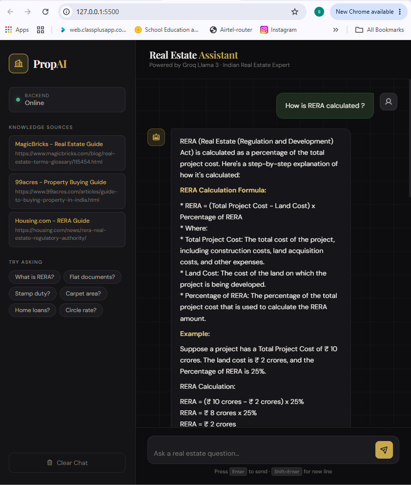
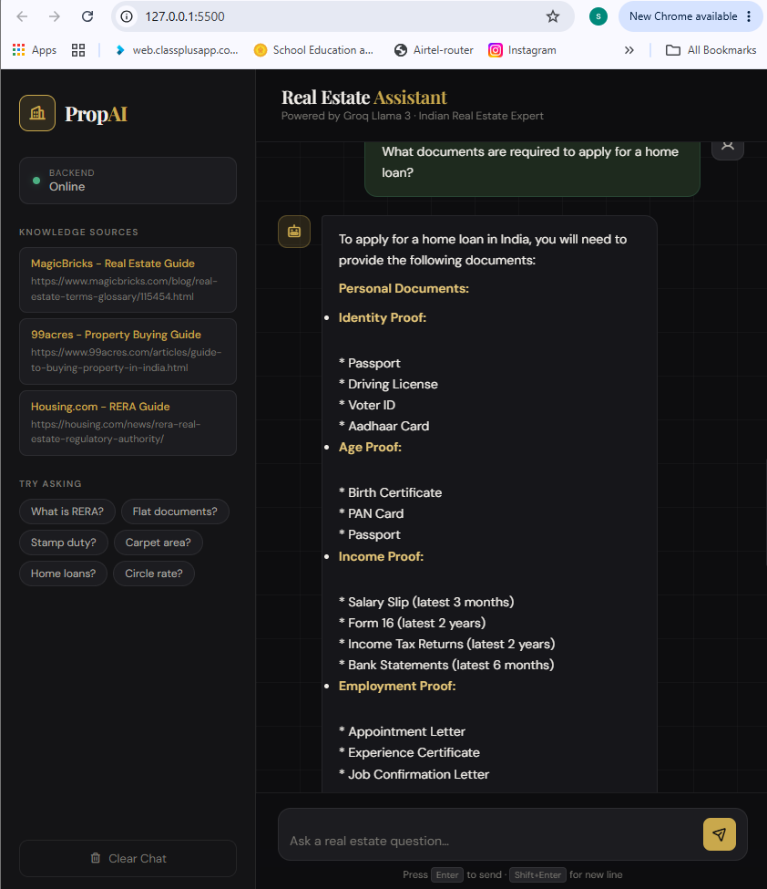

# Real Estate AI Assistant

A mini AI-powered Real Estate Assistant built using FastAPI, Groq LLM, HTML, CSS and JavaScript.

## Tech Stack

* Python
* FastAPI
* Groq LLM
* HTML
* CSS
* JavaScript

## Features

* Real Estate Q&A
* AI Chat Interface
* FastAPI Backend
* Responsive UI

## Screenshots





## Run

```bash
pip install -r requirements.txt
uvicorn api:app --reload
```

## Author

Sumedh Dikshit
